# FoodSup Searcher — архитектура

Статус: live-search-only MVP, 15.07.2026.

## Цель

Пользователь явно задаёт товар и субъект РФ, запускает поиск и получает временный набор карточек из открытых веб-источников. Предсозданной базы поставщиков в приложении нет.

## Стек

| Область | Реализация |
|---|---|
| UI | React 19, Next.js 16, TypeScript |
| Статическая публикация | Vite + GitHub Pages |
| Серверная функция | Yandex Cloud Functions, Node.js 22 |
| Внешний поиск | Yandex AI Studio Responses API + `web_search` |
| Валидация | Zod + строгая JSON Schema ответа модели |
| Состояние пользователя | валидируемый `localStorage` для критериев и заметок |
| Тесты | Node Test Runner через `tsx` |

## Поток данных

```mermaid
flowchart LR
    U["Пользователь"] --> G["Проверка ACCESS_CODE"]
    G --> UI["Статический React UI"]
    UI -->|"явный поиск + повторная проверка кода"| F["Yandex Cloud Function"]
    F --> V["Zod, лимит, кэш"]
    V --> A["Responses API: web_search + citations"]
    A --> P["Responses API: строгая JSON Schema"]
    P --> E["HTTP enrichment: HTML, JSON-LD, XLSX"]
    E --> R["Responses API: повторная структуризация фактов"]
    R --> S["Проверка URL, источников и географии"]
    S --> M["Детерминированный рейтинг"]
    M --> UI
```

## Контракт результата

Поисковая стадия собирает кандидатов несколькими вариантами запроса. Первая структурирующая стадия выбирает до восьми поставщиков. После этого сервер загружает исходную страницу каждого кандидата, выбирает до двух релевантных ссылок того же домена и извлекает текст HTML, JSON-LD и подходящие строки XLSX. Вторая структурирующая стадия обновляет коммерческие условия только по этому проверенному содержимому.

Сервер применяет дополнительные правила:

- принимает только публичные HTTP(S)-адреса из citations;
- проверяет каждый переход и DNS-адрес назначения, ограничивает размер ответа и не выходит за домен поставщика;
- отбрасывает карточки без подтверждённого источника или связи с выбранным субъектом;
- хранит набор источников карточки и отдельный URL доказательства для цены, MOQ, доставки, документов и контактов;
- не принимает название маркетплейса или каталога за поставщика;
- ограничивает статус документов из автоматического поиска значением `partial`;
- не принимает рейтинг от модели: баллы вычисляет приложение.

## Режимы запуска

`npm run dev` и `npm run build` используют Next.js и `/api/discover`.

`npm run build:pages` создаёт статический UI, который обращается к публичному URL функции из `VITE_DISCOVER_API_URL`. `npm run build:function` создаёт CommonJS bundle `dist-function/index.js` с entrypoint `index.handler`. API-ключ в браузер не передаётся.

Серверная Vite-сборка отключает копирование каталога `public`, поэтому ZIP функции содержит только исполняемый bundle, source map и `package.json`.

## Кэш и бюджет

- кэш результатов с 3–8 карточками по умолчанию 12 часов; результат с 1–2 карточками — 15 минут, пустой результат не кэшируется;
- не более 6 запросов в час на хэш клиента;
- общий дневной предел 100 операций на экземпляр;
- до 3 web-search вызовов, предварительная JSON-структуризация, HTTP-обогащение и одна финальная структуризация; при неполном предварительном JSON выполняется один повтор;
- общий таймаут 50 секунд;
- максимум 5 кандидатов.

In-memory кэш и счётчики допустимы для текущего MVP, но не являются глобальными между экземплярами. Для нагрузки их нужно перенести в YDB/Redis.

## Отказоустойчивость

Ошибка конфигурации, лимита, сети, провайдера или схемы показывает понятное сообщение. Текущий набор очищается при новом поиске, чтобы результаты разных запросов не смешивались. Секрет и сырой ответ провайдера клиенту не возвращаются.

Общий `ACCESS_CODE` проверяется отдельным действием до показа поиска и повторно в `discoverSuppliers`. Код хранится в `sessionStorage`, не попадает в URL или постоянное пользовательское состояние. Это ограничение демоверсии, а не замена пользовательской авторизации.

## Масштабирование

1. YDB/Redis для кэша, квот и дневного бюджета.
2. PostgreSQL только для пользовательских списков, заметок и истории запросов — не для скрытого предсозданного каталога.
3. Дедупликация по ИНН, телефону, домену и юридическому имени.
4. Очередь фоновой перепроверки сохранённых пользователем карточек и разбор PDF/OCR.
5. Headless Browser как ограниченный fallback для действительно JS-only сайтов.
