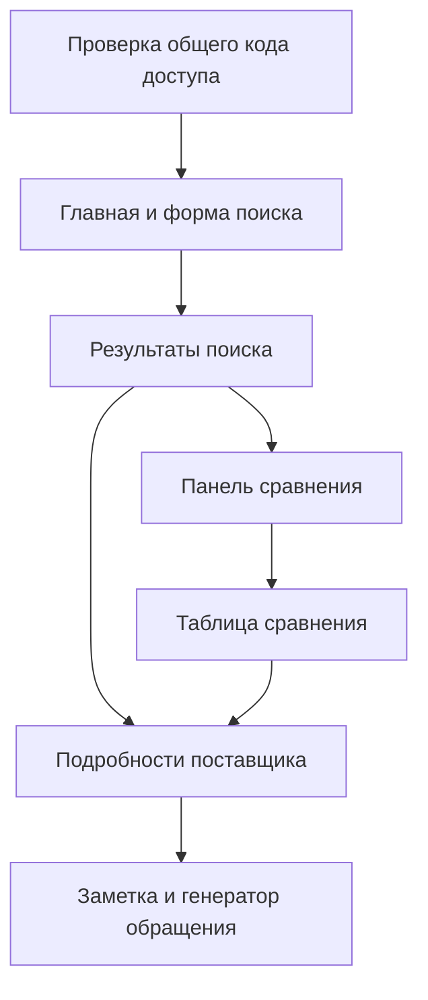

# FoodSup Searcher — UX-сценарий и экраны

Статус: реализовано 15.07.2026

## 1. Принцип интерфейса

Пользователь должен за 2–3 минуты пройти путь от запроса до короткого списка поставщиков. Интерфейс остаётся деловым и спокойным: светлый фон, один акцентный цвет, компактные карточки, читаемая типографика и минимум декоративных элементов.

Ключевые принципы:

- сначала запрос и результат, затем детали;
- неизвестные значения видимы и не выглядят ошибкой;
- источники доступны рядом с данными;
- итоговая оценка всегда имеет объяснение, а полнота профиля показана отдельным показателем;
- основные действия не требуют регистрации;
- AI обозначается как помощник, а не как безусловный источник истины.

## 2. Карта экранов

## 3. Главная страница

### Верхняя панель

- логотип/название FoodSup;
- подпись «Поиск по всей России»;
- кнопка «Закрыть доступ» для очистки кода на общем устройстве;
- ссылка «Как работает сервис».

### Первый экран

Перед интерфейсом показывается отдельный экран общего кода доступа. Код проверяется Cloud Function и хранится только до закрытия вкладки. При неверном коде форма поиска не отображается.

- короткий заголовок: «Найдите поставщика и сравните условия»;
- поле свободного запроса;
- выбор конкретного субъекта РФ и необязательное поле города или населённого пункта;
- необязательное поле объёма;
- одна явная кнопка «Найти поставщиков»;
- автоматическое определение одной из 12 категорий по найденным данным.

### Демонстрационный запрос

Под формой можно показать кликабельный пример:

> Моцарелла, Екатеринбург, 50 кг в неделю, нужна доставка и сертификаты.

Это одновременно объясняет возможности сервиса и ускоряет первое знакомство с интерфейсом.

## 4. Результаты поиска

### Верхняя часть

- строка результата с фактическим количеством карточек;
- сортировка;
- внешний поиск запускается только кнопкой в основной форме;
- краткое пояснение, что данные проверяются по открытым источникам.

### Боковые или выдвижные фильтры

- субъект РФ и населённый пункт;
- объём потребности и единица измерения для сравнения с MOQ;
- цена опубликована;
- сертификаты указаны;
- доставка доступна;
- обязательные условия: цена, документы и доставка.

### Карточка результата

Первый визуальный уровень:

- название, город, категории;
- итоговая оценка и 1–2 причины;
- ассортимент;
- MOQ, цена, доставка и документы;
- ссылка на источник рядом с подтверждённым условием;
- полнота профиля;
- дата проверки.

Действия:

- «Подробнее»;
- «Сравнить»;
- ссылка на сайт/источник;
- быстрый контакт, если доступен.

## 5. Подробности поставщика

Для скорости разработки используется боковая панель или модальное окно, а не отдельный маршрут. В нём находятся:

- полное описание и ассортимент;
- таблица условий;
- контакты;
- список источников;
- источник у каждого подтверждённого коммерческого условия;
- дата проверки;
- разбивка итоговой оценки по активным критериям;
- отдельный процент полноты данных;
- неизвестные параметры;
- поле пользовательской заметки;
- генератор обращения.

Если поставщик найден внешним поиском, над данными отображается заметная метка и предупреждение о необходимости ручной проверки.

## 6. Сравнение

После выбора первого поставщика внизу появляется закреплённая панель. Она показывает выбранные компании и кнопку «Сравнить».

Таблица сравнения включает:

| Строка | Поведение |
|---|---|
| Итоговая оценка | Учитывает запрос, географию, заданные условия и подтверждённость данных |
| Полнота данных | Показывает, сколько ключевых сведений найдено |
| MOQ | Показывает найденный минимальный заказ |
| Цена | Показывает опубликованное значение и единицу измерения |
| Сертификаты | Показывает подтверждение или необходимость уточнить |
| Доставка | Показывает опубликованные условия |
| Контакты | Даёт быстрый переход на сайт, email или телефон |

Под таблицей показывается осторожный приоритет для проверки:

> Поставщик A получил лучшую итоговую оценку среди выбранных. Перед заказом проверьте неизвестные условия.

## 7. Генератор обращения

Генератор не отправляет сообщения. Он формирует текст и копирует его в буфер обмена по кнопке.

Структура сообщения:

1. название выбранного поставщика;
2. интересующий товар и объём, если он задан;
3. вопросы по неизвестным параметрам;
4. просьба прислать коммерческое предложение и прайс.

Сообщение формируется детерминированным шаблоном, а факты берутся только из формы и карточки поставщика.

## 8. Состояния интерфейса

Обязательные состояния:

- первоначальный экран;
- загрузка поиска;
- результаты;
- нет результатов;
- фильтры исключили все результаты;
- внешний поиск недоступен без серверной настройки;
- ошибка внешнего провайдера без подмены локальными карточками;
- поставщик добавлен в сравнение;
- достигнут лимит четырёх поставщиков;
- заметка сохранена;
- текст обращения скопирован.

## 9. Визуальное направление

- фон: светло-серый или молочный;
- карточки: белые, тонкая граница, небольшой радиус;
- основной акцент: зелёный или тёмно-бирюзовый;
- предупреждения: спокойный янтарный;
- успех/подтверждение: зелёный;
- неизвестные данные: нейтральный серый;
- минимальная ширина поддержки: 360 px;
- основной десктопный макет: 1280–1440 px.

Не используются сложные иллюстрации, тяжёлые анимации или декоративные графики, которые не помогают выбору.

## 10. Доступность

- все действия доступны с клавиатуры;
- видимый фокус;
- контраст текста и состояний не ниже базовых требований WCAG AA;
- цвет не является единственным способом передать состояние;
- кнопки и ссылки имеют однозначные подписи;
- модальные панели возвращают фокус после закрытия.
